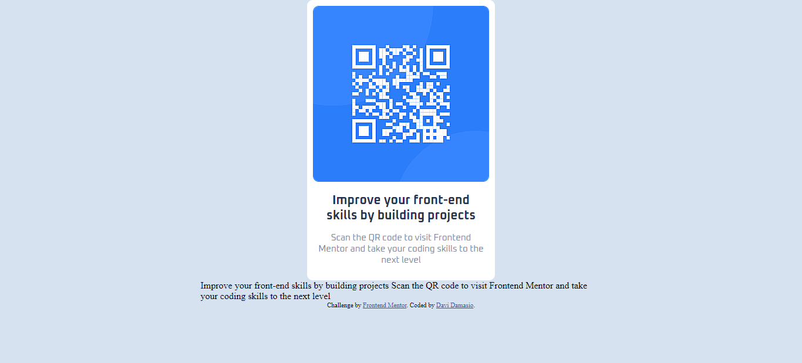

# Frontend Mentor - QR code component solution

This is a solution to the [QR code component challenge on Frontend Mentor](https://www.frontendmentor.io/challenges/qr-code-component-iux_sIO_H). Frontend Mentor challenges help you improve your coding skills by building realistic projects. 

## Table of contents

- [Overview](#overview)
  - [Screenshot](#screenshot)
  - [Links](#links)
- [Meu progresso](#meu-progresso)
  - [Feito com](#feito-com)
  - [O que eu aprendi](#o-que-eu-aprendi)

- [Author](#author)

## Overview
Projeto de desafio disponibilizado pelo FrontEnd Mentor, onde são disponibilizados desafios para serem montados pelo desenvolvedor, a fim de afiar suas habilidades.
### Screenshot

### Links

- Site com o projeto: [Add live site URL here](https://davi-damasio.github.io/Qr-code-component-FrontEndMentor/)

### Feito com

- HTML5 semântico
- CSS customizado
- Flow de trabalho mobile-first

### O Que Eu Aprendi

Aprendi como trabalhar com algumas coisas do html de forma mais eficiente, melhorando minhas habilidades ao praticar.

## Author

- Website - [Davi Damasio](https://davidamasio.com)
- Frontend Mentor - [@yourusername](https://www.frontendmentor.io/profile/yourusername)

**Note: Delete this note and add/remove/edit lines above based on what links you'd like to share.**

